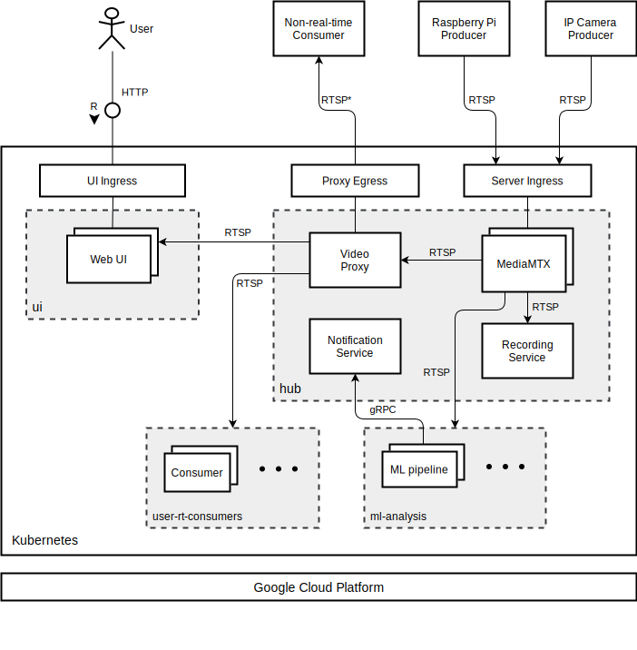

# smart-surveillance-docs
Documents and diagrams for the Smart Surveillance System

## Architecture

The Video proxy is for authentication, encryption of the video stream, transcoding for several bitrates, etc.

The recording service will encrypt the video before storing it in a Google Cloud Storage (GCS) instance.

A storage optimization that will be applied is that if no changes are detected within 2-3 minutes, the storage rate will be reduced to 1 frame per second, or even a frame every few seconds.

`*` The protocols for Non-real-time consumers are all that MediaMTX support. (e.g. RTSP, RTSP, WebRTC, HLS)

