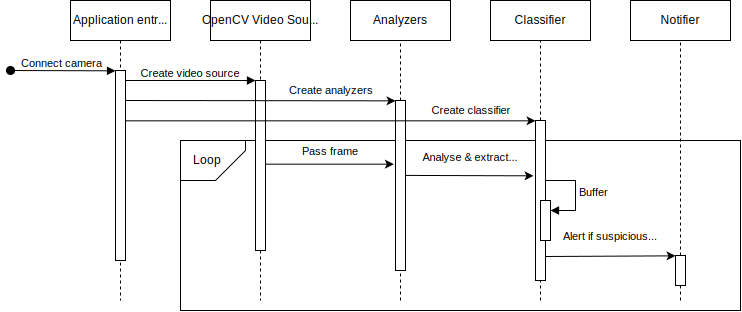

# smart-surveillance-docs
Documents and diagrams for the Smart Surveillance System

## System Architecture

The Video proxy is for authentication, encryption of the video stream, transcoding for several bitrates ([Adaptive Bitrate Streaming](https://webhostinggeeks.com/blog/adaptive-bitrate-streaming-what-is-it-how-it-works-and-why-it-matters/)), etc.

The recording service will encrypt the video before storing it in a Google Cloud Storage (GCS) instance.

A storage optimization that will be applied is that if no changes are detected within 2-3 minutes, the storage rate will be reduced to 1 frame per second, or even a frame every few seconds.

`*` The protocols for Non-real-time consumers are all that MediaMTX support. (e.g. RTSP, RTMP, WebRTC, HLS)

## Video analysis pipeline

The context clues are a finite list of predefined scene templates which will augment (disable components of) the analysis pipeline and decide which classifier to use.

This will optimize computing resources and analysis speed in certain scenes.

## Analysis sequence

